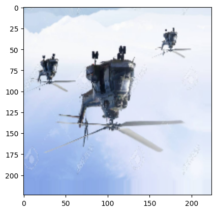
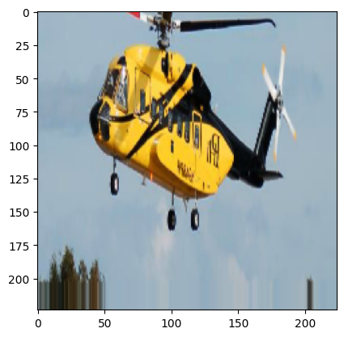
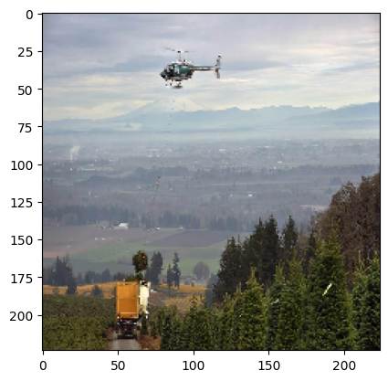
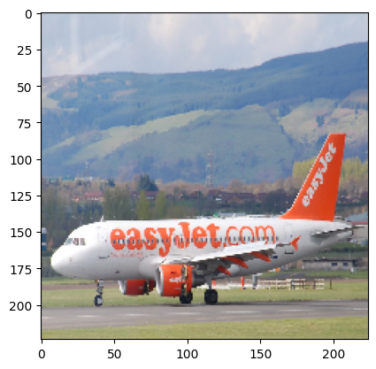
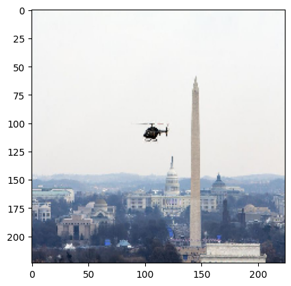
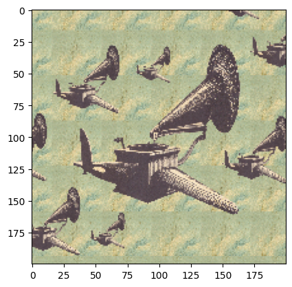
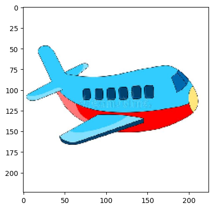

Results

The results in the above are more or less as expected except using data augmentation, as we increase the complexity of the model, the accuracy increases. This is directly proportional to the fact that as we increase the number of blocks in each model, we end up extracting better features from the input images and hence the model is trained better. 

One thing surprising here is that data augmentation does not really help as it decreases the test accuracy rather than increasing it. Some plausible explanations are as follows:

Airplane and Helicoptor both have numerous comparable features, when we augment the data, we sometimes end up with images that are not really airplanes or helicopters. This is because the augmentation is done randomly and we cannot control the augmentation to be done in a way that it does not affect the class of the image. In some cases the image is shrunken such that an airplane might look like a helicopter or vice versa. The images are also heavily dependent on the angles they are clicked from, for example, a helicopter might look like an airplane from a certain angle. This is also not taken into account when we augment the data. Hence, data augmentation might not be feasible for this case.

The following are some data augmentations that might have been problematc and the model was unsure about ie. the class probability was between 0.49-0.51:

Yes, the number of epochs affects the accuracy of the model. As we increase the number of epochs, the model is trained for a longer period of time and hence it is able to extract better features from the input images. This is directly proportional to the fact that as we increase the number of blocks in each model, we end up extracting better features from the input images and hence the model is trained better. This can also be seen from the graph above, as we increase the number of epochs, the accuracy increases for each model

The following are the images which the models are most confused about:

